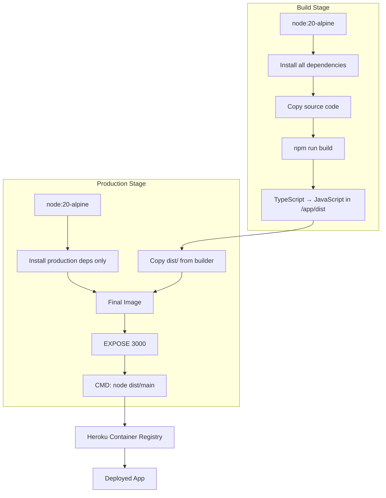

# Deployment

## CI/CD Pipeline

### Heroku Deployment

- **Steps**:

  1. Push to `main` branch triggers GitHub Actions workflow
  2. Checkout repository code
  3. Build Docker container using Dockerfile
  4. Push container to Heroku Container Registry
  5. Release container on Heroku

- **Test Automation**:

  - Unit tests: Run manually with `npm run test`
  - Integration tests: Not configured in CI/CD
  - E2E tests: Run manually with `npm run test:e2e`

- **Deployment Triggers**:
  - Manual deployments: Push to `main` branch
  - Automated deployments: Every push to `main` branch triggers deployment

## Deployment Process

- **Build Process**:

  - Multi-stage Docker build using Node.js 20 Alpine
  - Stage 1: Install all dependencies and build TypeScript → JavaScript
  - Stage 2: Production image with only production dependencies and compiled code
  - Output: Optimized container exposing port 3000

- **Application Startup**:
  - Production: `node dist/main` runs compiled application
  - Port: Uses `process.env.PORT` or defaults to 3000

# Infrastructure

## Project Structure

```plaintext
/
├── dist/                    # Compiled JavaScript output (Docker production)
├── src/                     # TypeScript source code
│   └── main.ts              # Application entry point
├── test/                    # End-to-end tests
├── Dockerfile               # Multi-stage production build
├── .github/workflows/       # CI/CD configuration
│   └── heroku.yml           # Heroku deployment workflow
└── @package.json            # Scripts and dependencies
```

## Environment Variables

### Environment Files

- No environment files in repository
- Environment variables configured in Heroku dashboard

### Required Environment Variables

- `PORT`: Application port (defaults to 3000 if not set)
- `HEROKU_EMAIL`: Heroku account email (GitHub secret)
- `HEROKU_API_KEY`: Heroku API key (GitHub secret)
- `HEROKU_APP_NAME`: Heroku application name (GitHub secret)

## URLs

- **Development**:

  - URL: http://localhost:3000
  - Purpose: Local development and testing

- **Production**:
  - URL: Configured via Heroku app name
  - Platform: Heroku Container Registry
  - Deployment: Automated via GitHub Actions

## Containerization


