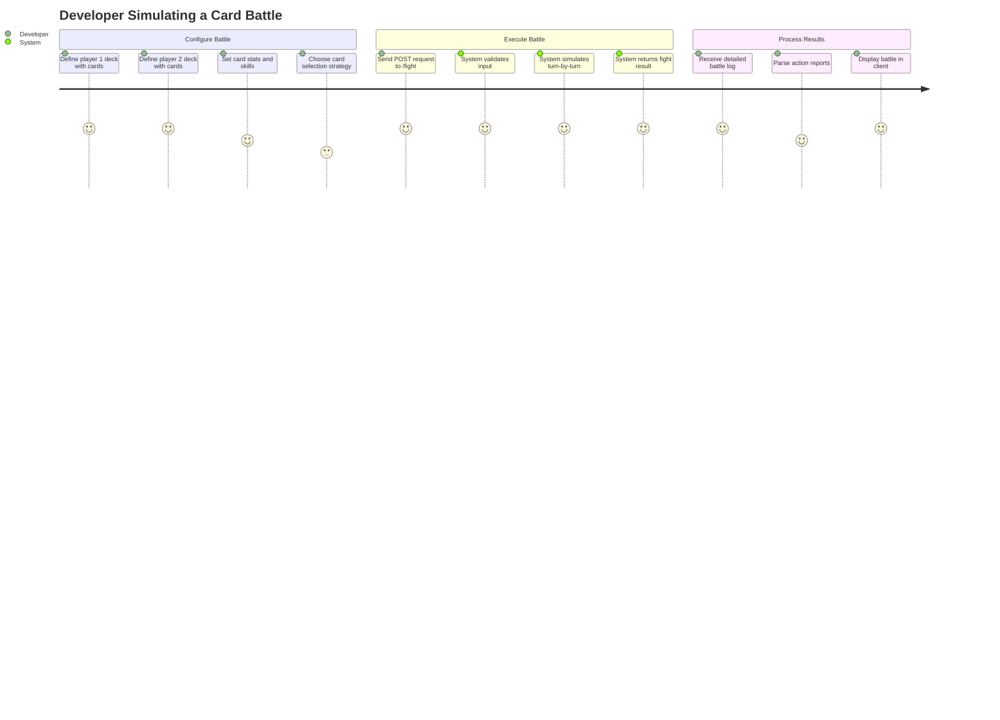

# PROJECT_BRIEF.md

A turn-based card battle simulator that orchestrates fights between players using decks of fighting cards with unique stats, skills, and behaviors. The system provides a RESTful API to simulate complete battles and returns detailed step-by-step fight results.

## Executive Summary

- **Project Name**: Card Game Battle Simulator
- **Vision**: Create a sophisticated card battle simulation engine with rich combat mechanics and strategic depth
- **Mission**: Build a flexible, testable backend system that simulates turn-based card battles with various combat strategies, status effects, buffs/debuffs, and skill systems

### Full Description

This is a NestJS-based backend application that simulates card battles between two players. Each player controls a deck of 1-5 fighting cards with customizable stats (attack, defense, health, speed, agility, accuracy, critical chance). The simulator processes turn-by-turn combat using configurable card selection strategies, resolves attacks and special abilities, applies status effects (poison, burn, freeze), manages buffs/debuffs, and determines winners based on remaining health. The application exposes a single HTTP endpoint that accepts battle configurations and returns complete fight logs with every action, damage calculation, and state change.

## Context

The project operates in the domain of turn-based combat simulation, focusing on providing a deterministic battle resolution engine for card-based games.

### Core Domain

The battle simulation domain encompasses strategic turn-based combat where entities (fighting cards) engage in battles using a combination of basic attacks, special abilities, and passive skills. The system models combat mechanics including damage calculation, dodge mechanics, status effect application, temporary stat modifications through buffs/debuffs, energy accumulation for special moves, and multi-card deck management. The core logic is isolated in the domain layer (@src/fight/core/) while the HTTP API layer (@src/fight/http-api/) handles request/response transformation.

### Ubiquitous Language

| Term | Definition | Synonymes |
| ---- | ---------- | --------- |
| Fighting Card | A combatant entity with base stats, dynamic state, skills, and behaviors | Card, Combatant |
| Player | Owns a deck of 1-5 fighting cards and participates in battles | Duelist |
| Deck | Collection of fighting cards owned by a player (min 1, max 5) | Card Collection |
| Simple Attack | Basic attack action performed when special energy is insufficient | Basic Attack, Normal Attack |
| Special | Ultimate ability requiring energy accumulation (attack or healing variant) | Ultimate, Special Move |
| Skill | Additional abilities triggered by events (e.g., turn-end healing/buffing) | Passive Skill, Ability |
| Status Effect | Ongoing condition affecting a card (poison, burn, freeze) | Debilitating Effect, Ailment |
| Buff | Temporary positive stat modification with duration | Stat Boost, Enhancement |
| Debuff | Temporary negative stat modification with duration | Stat Reduction, Penalty |
| Special Energy | Resource accumulated each turn to enable special moves | Energy, Ultimate Energy |
| Targeting Strategy | Determines which cards are affected by a skill (position-based, all, line-three, self, etc.) | Target Selection |
| Card Selector | Strategy for determining action order (player-by-player, speed-weighted) | Turn Order Strategy |
| Dodge Behavior | Determines how cards avoid attacks (simple-dodge, random-dodge) | Evasion Strategy |
| Action Stage | Phase where cards execute attacks, specials, or healing | Combat Phase |
| Turn Manager | Handles turn-end effects, buff/debuff duration, status damage | End-of-Turn Phase |
| Fight Result | Complete step-by-step record of battle events | Battle Log, Combat Result |
| Effect Level | Intensity of status effects (1-3) affecting potency and duration | Effect Potency |
| Element | Elemental affinity of a fighting card (PHYSICAL, FIRE, WATER, EARTH, AIR) | Card Element, Affinity |
| Damage Type | Type of damage dealt by an attack, matching Element values | Attack Element |
| Damage Composition | A type + rate pair defining a portion of an attack's damage | Damage Split |
| Elemental Matrix | 5x5 multiplier table defining effectiveness of each damage type against each element | Type Chart |
| Damage Calculator | Engine computing total damage from multiple damage compositions against a defender's element | Damage Engine |

## Features & Use-cases

The main use-cases and features of the project:

- Simulate complete turn-based battles between two players via REST API
- Support configurable deck sizes (1-5 cards per player)
- Execute combat rounds with card selection strategies (player-by-player or speed-weighted)
- Resolve simple attacks with damage calculation considering attack, defense, accuracy, dodge, and elemental effectiveness
- Support multi-damage type attacks (e.g., 70% physical + 30% fire) with per-type elemental matrix multipliers
- Trigger special abilities when energy threshold is met (attack or healing variants)
- Apply status effects on hit (poison, burn, freeze) with level-based potency
- Manage temporary stat buffs and debuffs with automatic duration tracking
- Process turn-end effects including status damage and skill triggers
- Track complete battle history with detailed action results
- Determine winners based on total remaining health
- Support multiple targeting strategies for skills (single target, all enemies, line-three, all allies, self)
- Handle card death events and update available card pools
- Enforce battle time limits (100 iterations max)

## User Journey maps

### Game Developer / Integrator

- Backend developer building a card game client
- Needs reliable battle simulation for player vs player or player vs AI battles
- Requires detailed combat logs for replays and analysis

#### Simulate a Battle

The developer sends a POST request to `/fight` with two player configurations including their deck compositions, card stats, skills, and the desired card selection strategy. The system processes the battle turn-by-turn, applying all combat mechanics, and returns a comprehensive fight result object containing every step of the battle. The developer uses this result to display the battle in their game client or for AI training purposes.

