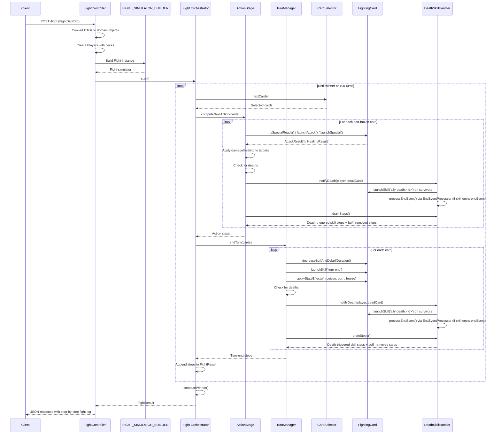

# Architecture

- [Architecture](#architecture)
  - [Language/Framework](#languageframework)
    - [Backend](#backend)
  - [Full project structure](#full-project-structure)
    - [Naming Conventions](#naming-conventions)
  - [Services communication](#services-communication)
    - [Fight Simulation Flow](#fight-simulation-flow)

## Language/Framework

### Backend

- **Language/Framework**: Node.js with NestJS 11 → @package.json
- **API Style**: REST - Single endpoint for fight simulation
- **Architecture**: Domain-Driven Design with hexagonal architecture - Core domain logic separated from HTTP layer
- **ORM**: None - No database, in-memory battle simulation
- **Schema path**: @src/fight/http-api/dto/fight-data.dto.ts - DTOs with class-validator decorators
- **Endpoints**: @src/fight/http-api/fight.controller.ts - Single POST /fight endpoint
- **Database**: None - Stateless battle simulator
- **Caching**: None
- **Testing**: Jest with unit tests alongside source files in `__tests__` directories

## Full project structure

```text
src/
├── main.ts                           # Application entry point with NestJS bootstrap
├── app.module.ts                     # Root module importing FightModule
├── logger-middleware.ts              # HTTP request logging middleware
└── fight/                            # Fight domain module
    ├── fight.module.ts               # NestJS module with DI configuration
    ├── http-api/                     # HTTP layer (adapters)
    │   ├── fight.controller.ts       # POST /fight endpoint
    │   ├── dto/
    │   │   └── fight-data.dto.ts     # Request DTOs with validation
    │   ├── targeting-strategy-factory.ts  # DTO enum → domain object mapping
    │   ├── dodge-strategy-factory.ts
    │   └── trigger-factory.ts
    ├── core/                         # Domain logic (pure business logic)
    │   ├── player.ts                 # Player entity managing deck of cards
    │   ├── randomizer.ts             # Random number generation interface
    │   ├── fight-simulator/          # Fight orchestration
    │   │   ├── fight.ts              # Main fight orchestrator
    │   │   ├── turn-manager.ts       # Turn-end effects processor
    │   │   ├── card-death-subscriber.ts  # Event listener interface
    │   │   ├── death-skill-handler.ts    # Triggers ally-death skills; accumulates + drains steps
    │   │   ├── end-event-processor.ts    # Removes event-bound buffs when a skill end event fires
    │   │   ├── @types/               # Fight result types
    │   │   └── card-selectors/       # Turn order strategies
    │   │       ├── card-selector.ts
    │   │       ├── player-by-player.ts
    │   │       └── speed-weighted-card-pool.ts
    │   ├── card-action/
    │   │   └── action_stage.ts       # Action resolution logic
    │   ├── cards/                    # Card domain
    │   │   ├── fighting-card.ts      # Main card entity
    │   │   ├── @types/               # Card-related types
    │   │   │   ├── card-info.ts
    │   │   │   ├── fighting-context.ts
    │   │   │   ├── action-result/    # Action result types
    │   │   │   ├── attack/           # Attack effects (poison, burn, freeze)
    │   │   │   ├── state/            # Status effect state
    │   │   │   ├── buff/             # Buff/debuff types
    │   │   │   └── damage/           # Damage types (DamageType, DamageComposition, Element)
    │   │   ├── skills/               # Card abilities
    │   │   │   ├── simple-attack.ts
    │   │   │   ├── special.ts        # Abstract special skill
    │   │   │   ├── special-attack.ts
    │   │   │   ├── special-healing.ts
    │   │   │   ├── skill.ts          # Event-triggered skill interface
    │   │   │   ├── healing.ts
    │   │   │   ├── buff-skill.ts
    │   │   │   └── debuff-skill.ts
    │   │   ├── behaviors/            # Card behaviors
    │   │   │   ├── dodge-behaviors.ts
    │   │   │   ├── simple-dodge.ts
    │   │   │   └── random-dodge.ts
    │   │   └── damage/              # Damage calculation engine
    │   │       ├── damage-calculator.ts   # Multi-type damage computation
    │   │       └── elemental-matrix.ts    # Element effectiveness multipliers
    │   ├── targeting-card-strategies/  # Targeting logic
    │   │   ├── targeting-card-strategy.ts
    │   │   ├── targeted-all.ts
    │   │   ├── targeted-from-position.ts
    │   │   ├── targeted-line-three.ts
    │   │   ├── all-owner-cards.ts
    │   │   ├── all-allies.ts
    │   │   └── launcher.ts
    │   └── trigger/                  # Skill trigger events
    │       ├── trigger.ts
    │       ├── turn-end.ts
    │       └── ally-death.ts         # Matches 'ally-death:<cardId>' trigger strings
    └── tools/                        # Utility implementations
        └── math-randomizer.ts
```

### Naming Conventions

- **Files**: kebab-case
- **Classes**: PascalCase
- **Functions**: camelCase
- **Variables**: camelCase
- **Constants**: UPPER_CASE (for maps and enums)
- **Types/Interfaces**: PascalCase
- **Private methods**: camelCase with private keyword

## Services communication

### Fight Simulation Flow

HTTP Request flows from controller through domain layers using dependency injection and factory pattern.



**Key architectural patterns:**

- **Hexagonal Architecture**: Core domain (`src/fight/core/`) isolated from HTTP layer (`src/fight/http-api/`)
- **Factory Pattern**: `FIGHT_SIMULATOR_BUILDER` injectable factory creates Fight instances with dependencies
- **Strategy Pattern**:
  - Card selection strategies (`PlayerByPlayerCardSelector`, `SpeedWeightedCardSelector`)
  - Targeting strategies (position-based, all-enemies, line-three, etc.)
  - Dodge behaviors (simple, random)
- **Observer Pattern**: `CardDeathSubscriber` interface for death notifications. `DeathSkillHandler` implements it: on each death it fires `ally-death:<cardId>` skill triggers on surviving allies, accumulates resulting steps, and exposes `drainSteps()` for callers (`ActionStage`, `TurnManager`) to collect them immediately after each death event. Handles all three skill kinds: **Healing** → `StepKind.Healing`, **Buff** → `StepKind.Buff`, **Debuff** → `StepKind.Debuff`. Also processes `endEvent` from skill results via `EndEventProcessor`, emitting `buff_removed` steps inline
- **Dependency Injection**: NestJS provider system for `FIGHT_SIMULATOR_BUILDER`
- **Value Objects**: Immutable types for attack effects, buffs, debuffs, damage compositions
- **Rich Domain Model**: `FightingCard` encapsulates stats, behaviors, element, and state mutations
- **Multi-Damage System**: `DamageCalculator` computes damage from multiple `DamageComposition` entries (type + rate), applying `ElementalMatrix` multipliers based on attacker damage types vs defender element
- **Buff Condition System**: `BuffApplication` has optional `condition: BuffCondition` and `conditionMultiplier`. If the condition evaluates to true at buff application time, the rate is multiplied. `buff-condition-factory.ts` maps `BuffConditionType` enum → `BuffCondition` instance. First implementation: `AllyPresenceCondition` checks that a named ally is alive in the source player's team.
- **Event-Driven**: Skills triggered by events (`turn-end`, `next-action`, `ally-death:<cardId>`), extensible trigger system. `AllyDeath` trigger matches string pattern `ally-death:<targetCardId>` enabling death-reactive abilities
- **Unified Special Result**: `Special.launch()` returns `SpecialResult` containing both `actionResults` (AttackResult[] or HealingResult[]) and `buffResults` (BuffResults) for consistent handling across attack and healing specials
- **Event-Bound Buff Termination**: `Buff` type has optional `terminationEvent?: string`. Skills have optional `activationLimit` and `endEvent`. When a skill reaches its activation limit (or its owner dies), it emits its `endEvent`. `EndEventProcessor` scans all playable cards and removes buffs matching that event name, emitting a `StepKind.BuffRemoved` step. `SkillResults` carries an optional `endEvent` field so callers know to trigger `EndEventProcessor`.
- **Skill Lifecycle Interface**: `Skill` interface has two optional lifecycle methods: `tick?()` (advance internal state each turn) and `lifecycleEndEvent?()` (return end event name if skill is active and lifecycle-limited).
- **Separation of Concerns**:
  - `Fight` orchestrates battle flow
  - `ActionStage` handles attack/heal resolution and extracts buff applications from special results
  - `TurnManager` handles turn-end effects
  - `CardSelector` determines turn order
  - `EndEventProcessor` handles event-bound buff removal across all cards
